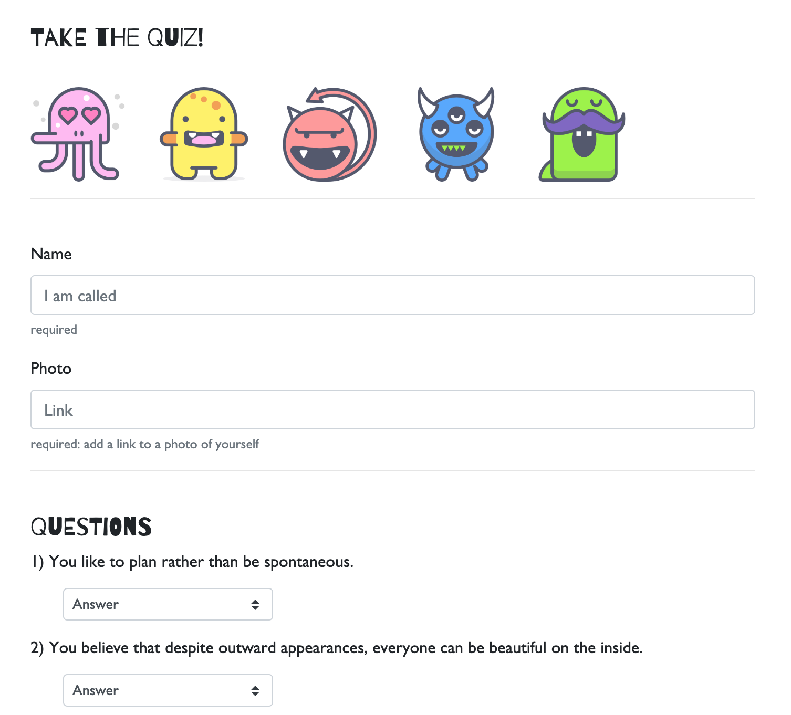

# FriendFinder: Monster Edition
This application takes user input and compares it to other user input to see how well users match. 

## It's tough being a monster
Hding in the dark and spending your days planning ways to best scare people can be a lonely existence. That's why FriendFinder: Monster Edition helps monsters feel that they are not alone. 

## How it works
This is a full stack application made using:
* HTML
* CSS
* JavaScript
* Bootstrap 
* Node.js
* Express
* Heroku (for deployment)

Friend Finder uses a quiz format to capture user information. The quiz requires users to submit a Name, Link to a photo of themselves, and answer a series of 10 personality questions. The questions are answered on a scale of 1 to 5 with 1 being "disagree" and 5 being "agree." 

Upon hitting the submit button the user's answers are run through an algorithm that compares to previous user's answers. This is done by 
* converting the answers to an array of numbers. 
* comparing the user's answer to all previous answers question by question to get the difference of each. Such as:
  * Current User Array index[0] = 5
  * Previous User Array index[0] = 2
  * The difference is 3
* Once all 10 answers in the array have been run through add the differences to get the Total Difference.
* The lowest Total Difference is the best friend match.

 Once a match is found, a modal pops up with a new friend's name and photo.

A link to the Friends API will display the answers from all of the previous monsters who have taken the test.

### Deploy to Heroku
The functioning app is deployed to Heroku <a href="">HERE</a>.

### Extras
Monster icons were made by Darius Dan and can be found <a href="https://www.flaticon.com/packs/monsters-12">here</a> at Flaticon.

